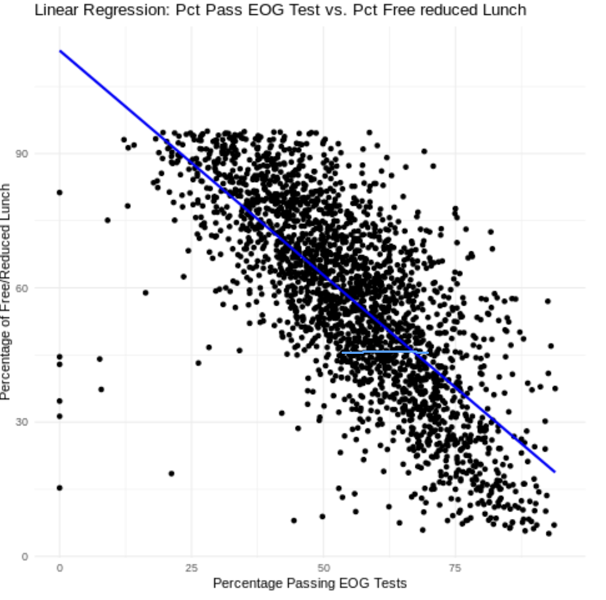
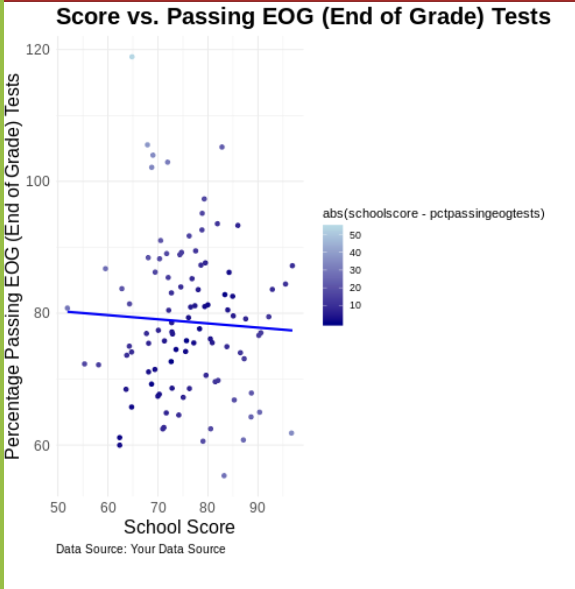
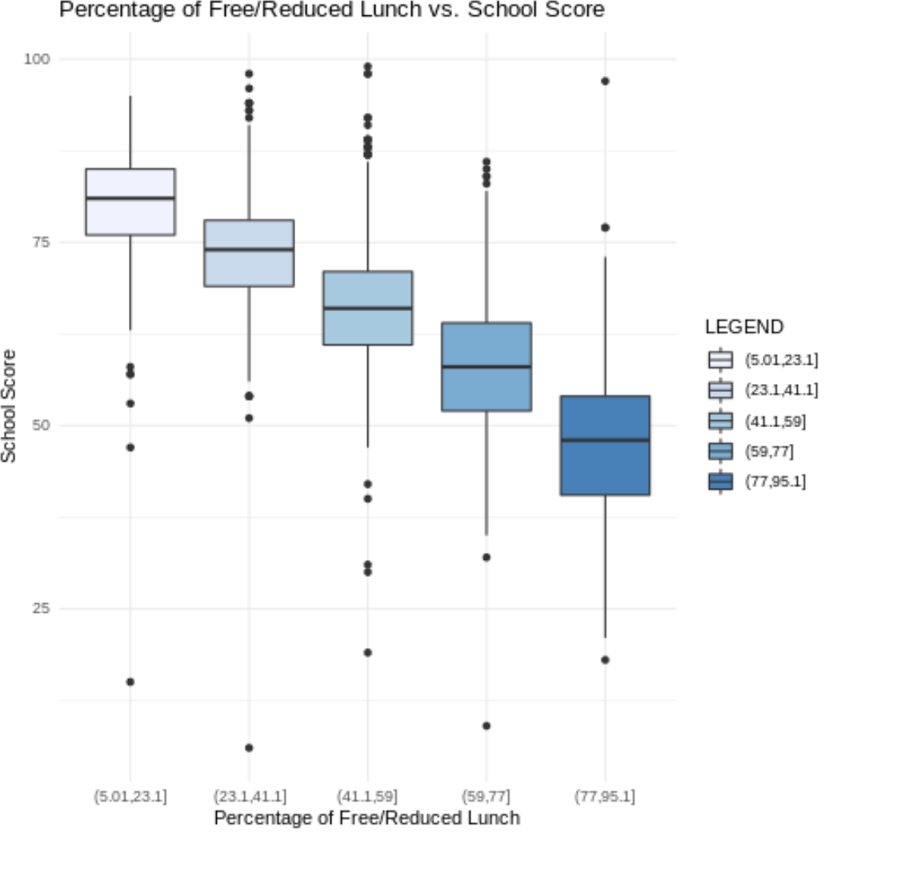
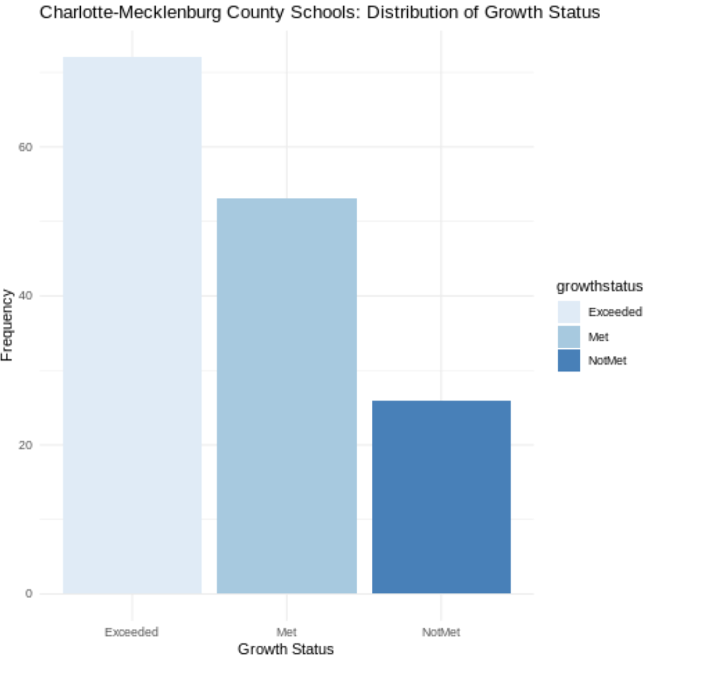

# North-Carolina-Public-Charter-School-Report
## overview   
This is wonderful   
....   
I forgot to put 3 spaces
This is a new line   

---   

## descriptions   
**Hello**   
*World*   
`baby panda`   
   
This is a list   
* Info   
* Info   
* Info
   
This is another list   
1. Item 1   
2. Item 2
   1. subitem 1
   2. subitem 2
      
This is an indentation   
> This is a sentence   
This is code   
```python   
dictionary ={"name": "Fido", "age": 9}   
```   
---   
## approaching   
---   
   
   
   

## report   
   
## conclusion 
